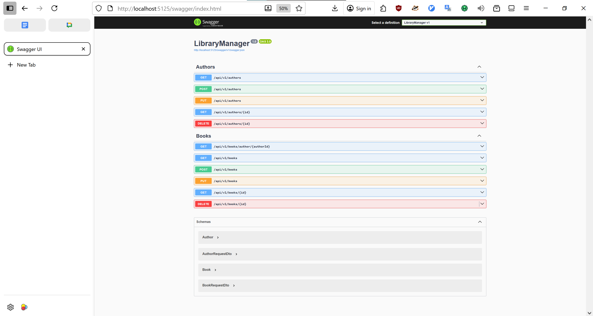

# 📚 Library Manager

Простое **backend-приложение** для управления библиотекой.  
Позволяет выполнять **CRUD-операции** с **авторами** и **книгами**.  
Фронтенд отсутствует — взаимодействие осуществляется через **Swagger UI**.

---

## 🚀 Функциональность

### 🔸 Авторы

- Добавление нового автора
- Получение списка всех авторов
- Получение автора по ID
- Обновление данных автора
- Удаление автора

### 🔸 Книги

- Добавление новой книги
- Получение списка всех книг
- Получение списка всех книг по id автора
- Получение книги по ID
- Обновление информации о книге
- Удаление книги

---

## 🧩 Технологии

- **.NET 8 / ASP.NET Core Web API**
- **Swagger / Swashbuckle** — интерактивная документация API

---

## ⚙️ Запуск проекта

1. Клонируйте репозиторий:

   ```bash
   git clone https://github.com/your-username/library-manager.git
   ```

2. Перейдите в директорию проекта:

   ```bash
   cd library-manager
   ```

3. Запустите приложение:

   ```bash
   dotnet run
   ```

4. Откройте Swagger UI:
   ```bash
   http://localhost:5000/swagger
   ```

---

## 📘 Примеры API

| Метод  | Endpoint                       | Описание                |
| ------ | ------------------------------ | ----------------------- |
| GET    | `/api/authors`                 | Получить список авторов |
| GET    | `/api/authors/{id}`            | Получить автора по ID   |
| POST   | `/api/authors`                 | Добавить нового автора  |
| PUT    | `/api/authors`                 | Обновить данные автора  |
| DELETE | `/api/authors/{id}`            | Удалить автора          |
| GET    | `/api/books`                   | Получить список книг    |
| GET    | `/api/books/{id}`              | Получить книгу по ID    |
| GET    | `/api/books/author/{authorId}` | Получить книгу по ID    |
| POST   | `/api/books`                   | Добавить новую книгу    |
| PUT    | `/api/books/`                  | Обновить данные книги   |
| DELETE | `/api/books/{id}`              | Удалить книгу           |

---

## 🖼 Скриншоты


